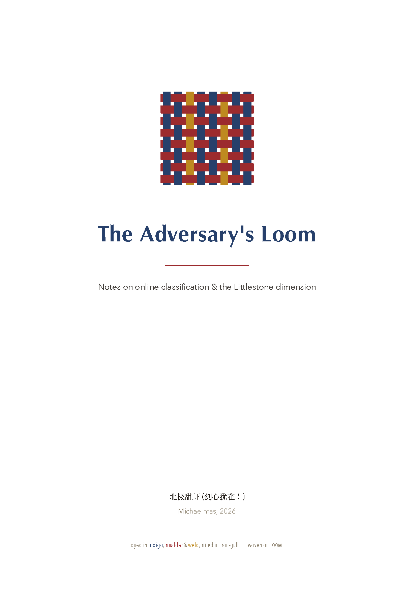
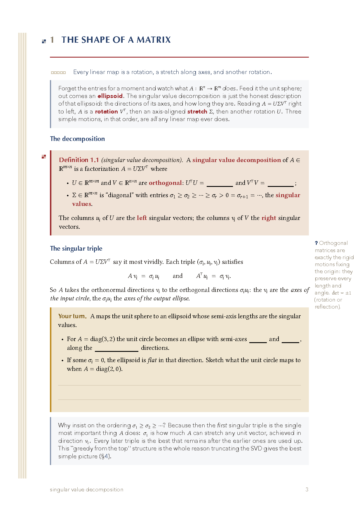
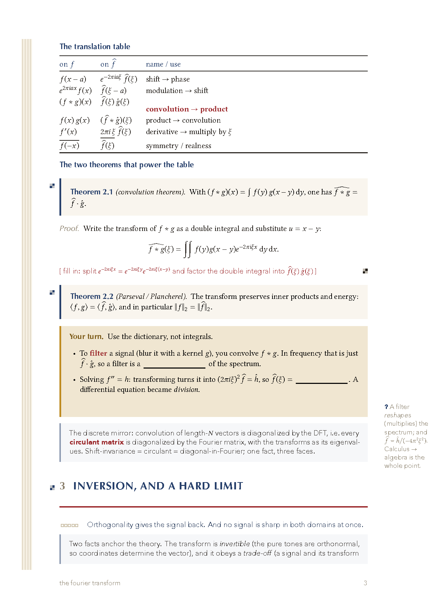
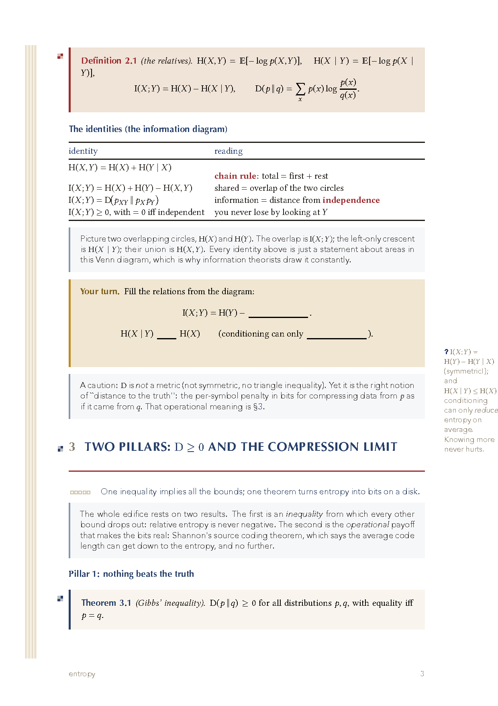
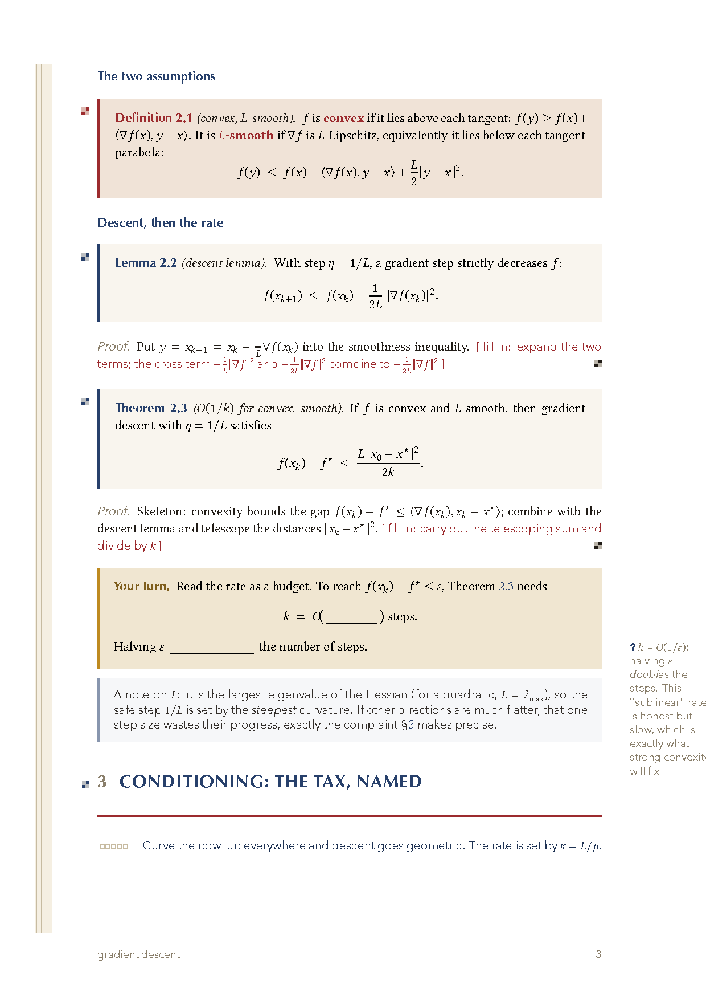
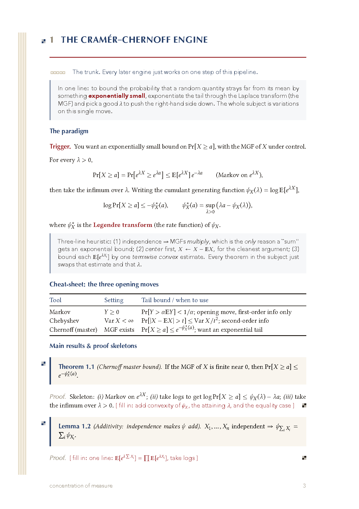
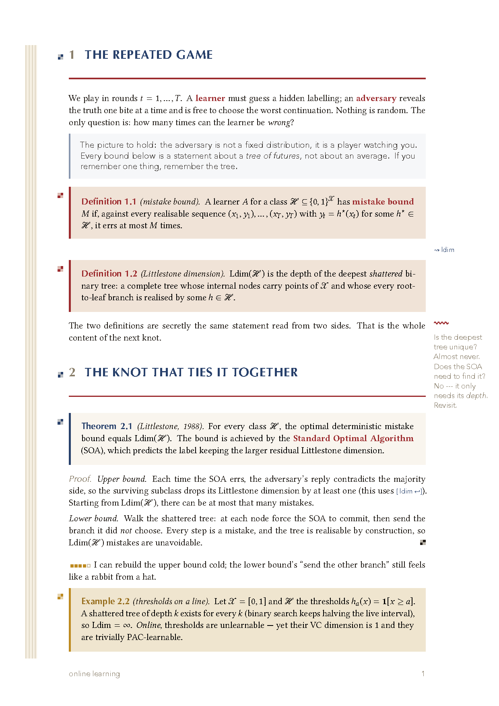

<div align="center">

# 🧶 Loom

### Weave your understanding — a gorgeous XeLaTeX class for **fill-in study notes**

*Notes you both **read** and **fill**: statements and intuition to take in,
blanks and proof-skeletons to work out. Learn by active recall, on paper that
looks like an illuminated manuscript.*



[](LICENSE)


</div>

---

## Why Loom

Most notes are **read-only**: definition → theorem → proof, flowing past your
eyes. You finish the page and remember nothing. Loom typesets the *other* layer
too — **the weave of your own understanding**:

- 🧵 **A page is cloth on a loom.** *Warp* threads are the ideas in play (a left
  selvage rail). *Knots* are results that bind them (theorem boxes). *Loose
  threads* are your open questions. A *warmth gauge* records how well you actually
  grok each block.
- ✍️ **Passive + active in one document.** The exposition is written to be **read**;
  the high-value steps are left **blank** (`\fillin`), proofs ship as **skeletons**
  (`\TODO`), and the book's examples are restaged as **"your turn"** computations.
  The source is your answer key.
- 🎨 **Dyed in real pigments.** Indigo, madder, weld, iron-gall — historical
  textile and ink dyes no maths template uses. Headings incised in Optima, body
  and math in Libertinus, 中文 in Songti/楷体. Every cover carries a
  procedurally-woven emblem.
- 🤖 **An AI skill that writes them for you.** Point Claude at a chapter and the
  [`fill-in-notes` skill](skill/SKILL.md) produces a complete, compiling notebook
  in this style — organized around a *spine*, not transcribed.

<div align="center">
<table>
<tr>
<td></td>
<td></td>
</tr>
<tr>
<td align="center"><em>Singular Value Decomposition — a definition knot, the geometry, a <b>Your&nbsp;turn</b></em></td>
<td align="center"><em>Fourier transform — the dictionary, the convolution theorem</em></td>
</tr>
<tr>
<td></td>
<td></td>
</tr>
<tr>
<td align="center"><em>Entropy — the information diagram, Gibbs' inequality</em></td>
<td align="center"><em>Gradient descent — the rate, and the cost of conditioning</em></td>
</tr>
<tr>
<td></td>
<td></td>
</tr>
<tr>
<td align="center"><em>Concentration of measure — theorem stated, proof left as a skeleton</em></td>
<td align="center"><em>Every device on one page (the demo)</em></td>
</tr>
</table>
</div>

## Quickstart

```bash
git clone https://github.com/Polaris-Aeterna/loom-notes.git
cd loom-notes/template
latexmk -xelatex main.tex      # or: xelatex main.tex (twice)
```

Then write. A blank starter, doubling as a live cheat-sheet of every command, is
in [`template/main.tex`](template/main.tex). Open the repo in **VS Code** and the
bundled [`.vscode/settings.json`](.vscode/settings.json) builds with XeLaTeX on
every save (LaTeX Workshop defaults to pdflatex, which fails here).

> **Requirements.** XeLaTeX (TeX Live 2023+). Libertinus ships with TeX Live;
> Optima / Avenir Next / Songti / 楷体 are macOS system fonts. On other platforms,
> swap the three `\newfontfamily` lines in [`loom.cls`](loom.cls) for any display
> sans — everything else stays.

## The toolkit (all built into the class)

| you want… | you write… |
|---|---|
| the woven cover | `\loomcover{title}{sub}{author}{date}` |
| a result / definition / example | `theorem` · `definition` · `example` (auto-styled knots) |
| the intuition voice | `strand` env, `\whisper{…}`, `\keyword{…}` |
| **a blank to fill** | `\fillin[width]` |
| **a proof gap** | `\TODO{the missing step}` |
| **a do-it-yourself box** | `yourturn` env + `\workspace[n]` ruled lines |
| **how well you grok it** | `\warmth{0..5}` |
| a margin recall prompt | `\recall{question}` |
| an open thread / a recurring object | `\loose{…}` · `\warp{key}` / `\pick{key}` |

Full reference: [`skill/reference/loom-commands.md`](skill/reference/loom-commands.md).

## The AI skill

[`skill/`](skill/) is a Claude skill that turns a textbook chapter, lecture, or
paper into a finished Loom notebook: it finds the **spine**, drafts each section in
the Loom grammar, engineers the gaps at the right density (~70% read / 30% fill),
compiles, and verifies. See [`SKILL.md`](skill/SKILL.md), and the hard-won XeLaTeX
gotchas in [`reference/pitfalls.md`](skill/reference/pitfalls.md).

## Examples

The first four are **original expositions of public-domain mathematics** — one each from linear
algebra, signals, information, and optimization — safe to learn from and to share.

| | the spine |
|---|---|
| [`examples/svd/`](examples/svd) | **the Singular Value Decomposition** — *"ask a matrix anything; read the answer off Σ"* |
| [`examples/fourier-transform/`](examples/fourier-transform) | **the Fourier transform** — *"Fourier is the eigenbasis of shift"* |
| [`examples/entropy/`](examples/entropy) | **entropy** — *"the price of uncertainty: you can't pay less, you needn't pay more"* |
| [`examples/gradient-descent/`](examples/gradient-descent) | **gradient descent** — *"the rate is a tax on conditioning"* |
| [`examples/concentration-of-measure/`](examples/concentration-of-measure) | concentration of measure — proof-skeleton style, organized "by engine" |
| [`examples/nonlinear-algebra/`](examples/nonlinear-algebra) | nonlinear algebra, Ch. 1–2 — closely follows Michałek–Sturmfels (GSM 211); cite the book |
| [`examples/demo/`](examples/demo) | every visual feature on two pages |

## License & credits

Code (the `loom.cls` class and the skill): **MIT** — see [LICENSE](LICENSE). Use it,
fork it, re-dye it.

The example **notebooks** are study notes that restate results from their sources
(cited inline). They're shared under fair-use for education; if you publish notes
that closely track a copyrighted text, attribute clearly and prefer an original
example. The mathematics belongs to its authors.

Woven by **北极甜虾 (Polaris)**, 2026. Type by Libertinus, Optima, Avenir Next.
Dyes after indigo, madder, weld, and iron-gall.

<div align="center"><sub>If Loom makes a hard chapter feel like 砍瓜切菜 — star it. 🦐</sub></div>
